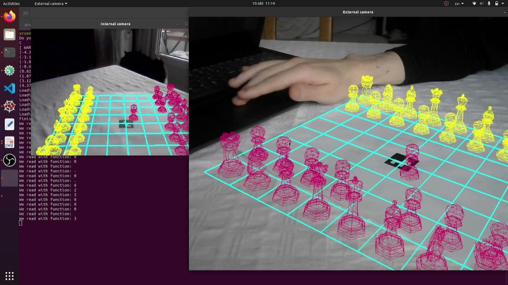

This is an implementation of Augmented Reality using C++ using OpenCV and OpenGL I made a while ago.

The solution utilizes a "server" and a "client". The server has to initialize the connection, after which the client has to connect to the server.

The connect.cc-file defines the threads used, and is using hardcoded values for the optics of my laptop.
In order to utilize the code on your machine, you will need an external camera, an internal camera and the K-matrix as well as the distortion coefficients for these.

Result can be seen below:

Video of project:

